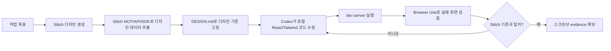

# Codex, LazyCodex, Stitch, Browser Use 정리

> [!summary]
> 핵심은 **디자인 기준을 만들고, agent가 그 기준을 보고, 로컬 코드를 수정한 뒤, 실제 브라우저에서 다시 검증하는 루프**다.  
> Stitch는 디자인 컨텍스트를 제공하고, Codex는 로컬 코드베이스를 수정하며, Browser Use와 LazyCodex는 시각 검증과 반복 실행을 담당한다.

## 핵심 결론

Codex/LazyCodex가 Google Stitch를 활용해 프론트엔드 품질을 높이는 구조는 다음과 같다.

```text
Browser Use
  = 시각 확인, 클릭, 입력, 스크린샷, 브라우저 QA

Stitch MCP/API/SDK
  = 디자인 데이터, HTML, 스크린샷, 프로젝트/화면 정보 접근

Codex
  = 로컬 코드 수정

LazyCodex
  = 계획, 실행, 검증 루프를 끝까지 밀어붙이는 오케스트레이터
```

즉, 코드 수정 자체가 Stitch에서 일어나는 것은 아니다.

Stitch는 디자인 산출물과 디자인 컨텍스트를 제공하고, 실제 프로젝트 파일 수정은 Codex가 로컬 코드베이스에서 수행한다.

## 전체 구조



## Browser Use의 역할

Codex의 Browser Use는 내장 브라우저를 직접 조작할 수 있게 해준다.

가능한 작업은 다음과 같다.

- 웹페이지 열기
- 버튼 클릭
- 텍스트 입력
- 렌더링 상태 확인
- 스크린샷 캡처
- 페이지 asset 다운로드
- read-only JavaScript 실행
- 수정 결과를 브라우저에서 검증

Browser Use의 핵심 가치는 코드 생성이 아니라 **실제 렌더링 결과를 agent가 직접 확인할 수 있게 한다는 점**이다.

## Stitch의 역할

Google Stitch는 자연어 또는 이미지 입력으로 UI 디자인과 프론트엔드 코드를 생성하는 Google Labs 도구다.

Stitch는 이 흐름에서 다음 역할을 한다.

- UI 디자인 생성
- 디자인 변형 생성
- HTML/CSS 또는 화면 이미지 제공
- 디자인 시스템 추출
- `DESIGN.md` 기반 디자인 규칙 공유
- MCP/SDK를 통한 agent 연동

Stitch SDK를 사용하면 텍스트 프롬프트로 UI screen을 생성하고, HTML과 스크린샷 URL을 가져올 수 있다.

## MCP의 역할

MCP는 Codex나 Claude 같은 agent가 외부 도구와 구조적으로 연결되는 통로다.

이 흐름에서 Stitch MCP는 다음을 담당한다.

- Stitch project 목록 확인
- screen 정보 가져오기
- generated HTML 가져오기
- screenshot/image URL 가져오기
- 디자인 메타데이터 추출
- `DESIGN.md` 생성에 필요한 디자인 컨텍스트 제공

Google Codelab에서는 MCP가 Antigravity와 Google Stitch 사이의 bridge 역할을 하며, agent가 Stitch project에서 Design DNA를 직접 가져올 수 있다고 설명한다.

## DESIGN.md의 역할

`DESIGN.md`는 AI agent가 디자인 시스템을 이해하도록 만든 문서 포맷이다.

주요 역할은 다음과 같다.

- 색상 토큰
- 타이포그래피
- spacing
- radius
- component 규칙
- layout 원칙
- 디자인 의도
- 금지 패턴

Google의 `DESIGN.md` spec은 machine-readable design token과 human-readable design rationale을 결합한다고 설명한다.

이 흐름에서는 Stitch 결과물을 `DESIGN.md`로 추출한 뒤, Codex/Claude가 그 문서를 기준으로 React/Tailwind 코드를 작성한다.

## LazyCodex의 역할

LazyCodex는 Codex를 위한 agent harness다.

핵심 기능은 다음과 같다.

- project memory
- planning
- execution
- verified completion
- skills
- hooks
- model routing
- subagent orchestration

LazyCodex 공식 repo는 “Project memory, planning, execution, and verified completion inside Codex”라고 설명한다.

LazyCodex는 Codex가 단순히 코드를 생성하는 데서 멈추지 않고, 계획, 실행, 검증, QA 루프를 반복하게 만든다.

## 공개 소스에서 확인한 점

LazyCodex repo 안에는 프론트엔드 품질을 높이기 위한 skill들이 공개되어 있다.

확인한 주요 파일은 다음과 같다.

```text
plugins/omo/skills/frontend/SKILL.md
plugins/omo/skills/frontend/references/design/stitch-skill.md
plugins/omo/skills/frontend/references/design/README.md
plugins/omo/components/ultrawork/directive.md
plugins/omo/skills/ultimate-browsing/SKILL.md
```

### frontend skill

프론트엔드, UI, UX, visual work에 반드시 사용되는 skill이다.

주요 원칙은 다음과 같다.

- `DESIGN.md` 없이는 UI 작업하지 않음
- 디자인 시스템을 먼저 생성하거나 읽음
- React dev tooling 사용
- 실제 브라우저에서 QA
- screenshot evidence 확보

### stitch-skill

Google Stitch용 `DESIGN.md`를 생성하는 skill이다.

이 skill은 Stitch screen generation에 최적화된 `DESIGN.md` 파일을 생성한다고 설명한다.

주요 내용은 다음과 같다.

- Visual atmosphere
- Color calibration
- Typography architecture
- Component behavior
- Layout principles
- Motion philosophy
- Anti-patterns

### ultrawork directive

작업 완료를 테스트만으로 판단하지 않고 실제 사용 surface에서 검증하도록 강제한다.

Browser-facing criterion은 Chrome 또는 agent-browser를 사용해 실제 페이지를 조작하고, action log와 screenshot을 남기도록 되어 있다.

## Codex에서의 이상적인 흐름

```text
1. Codex/LazyCodex가 작업 목표를 받음
2. Browser Use로 Stitch를 열고 디자인 생성
3. Stitch 결과를 시각적으로 확인
4. 결과가 별로면 프롬프트를 수정해 재생성
5. Stitch MCP/API로 HTML, screenshot, design metadata 추출
6. DESIGN.md 생성
7. Codex가 로컬 React/Tailwind 코드 수정
8. dev server 실행
9. Browser Use로 로컬 구현 결과 확인
10. Stitch 결과와 비교
11. mismatch 수정
12. screenshot evidence 확보
```

## Claude에서도 가능한가

가능하다. 다만 구조는 다르다.

Claude 쪽 대응 관계는 다음과 같다.

```text
Codex Browser Use
  ≈ Claude Code + Playwright MCP

Codex Chrome plugin
  ≈ Claude in Chrome

Codex/LazyCodex skills
  ≈ Claude Code Skills

Computer Use
  ≈ Anthropic Computer Use API
```

Playwright MCP는 Claude Code에서 브라우저 자동화를 가능하게 한다. Playwright 공식 문서는 Claude Code 설정 명령을 제공한다.

Claude in Chrome은 Claude Code와 Chrome extension을 연결해 build-test-verify workflow를 지원한다.

## 최종 정리

이 구조의 핵심은 “AI가 코드를 잘 짜게 만드는 것”보다 **AI가 볼 수 있는 디자인 기준과 검증 루프를 만들어주는 것**이다.

핵심 구성은 다음과 같다.

```text
시각 인식
  = Browser Use 또는 Playwright MCP

디자인 원천
  = Google Stitch

구조화된 디자인 데이터
  = Stitch MCP/API/SDK

디자인 규칙
  = DESIGN.md

코드 수정
  = Codex 또는 Claude Code

검증 루프
  = LazyCodex, Claude Skills, ultrawork류 workflow
```

한 문장으로 요약하면 다음과 같다.

> Browser Use로 시각 상태를 보고, Stitch MCP/API로 디자인 데이터를 가져오고, `DESIGN.md`로 기준을 고정한 뒤, Codex 또는 Claude가 코드를 수정하고 브라우저에서 다시 검증하는 agentic frontend workflow다.

## 참고 링크 후보

나중에 출처를 붙일 경우 아래 항목을 확인해 링크로 보강하면 좋다.

- OpenAI Codex Browser Use 문서
- Google Stitch 공식 페이지 또는 Codelab
- Stitch MCP/API/SDK 문서
- Google `DESIGN.md` spec
- LazyCodex GitHub repository
- Playwright MCP 공식 문서
- Claude in Chrome 문서
